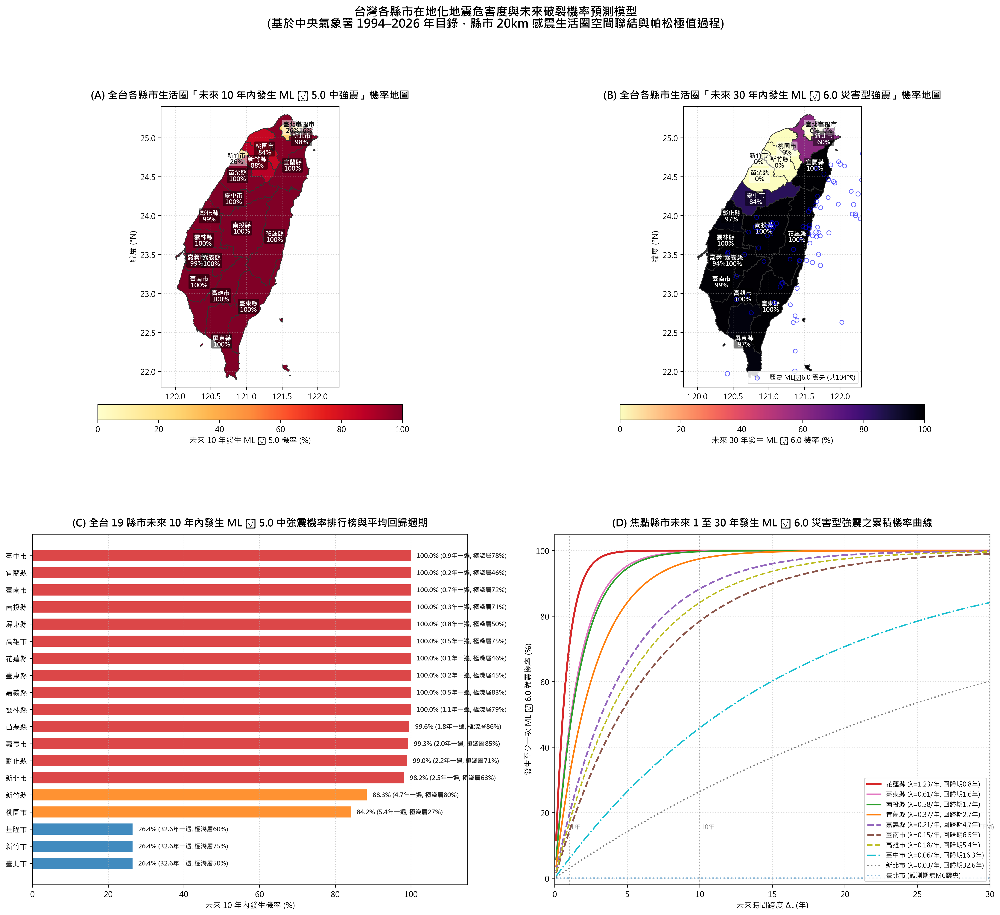
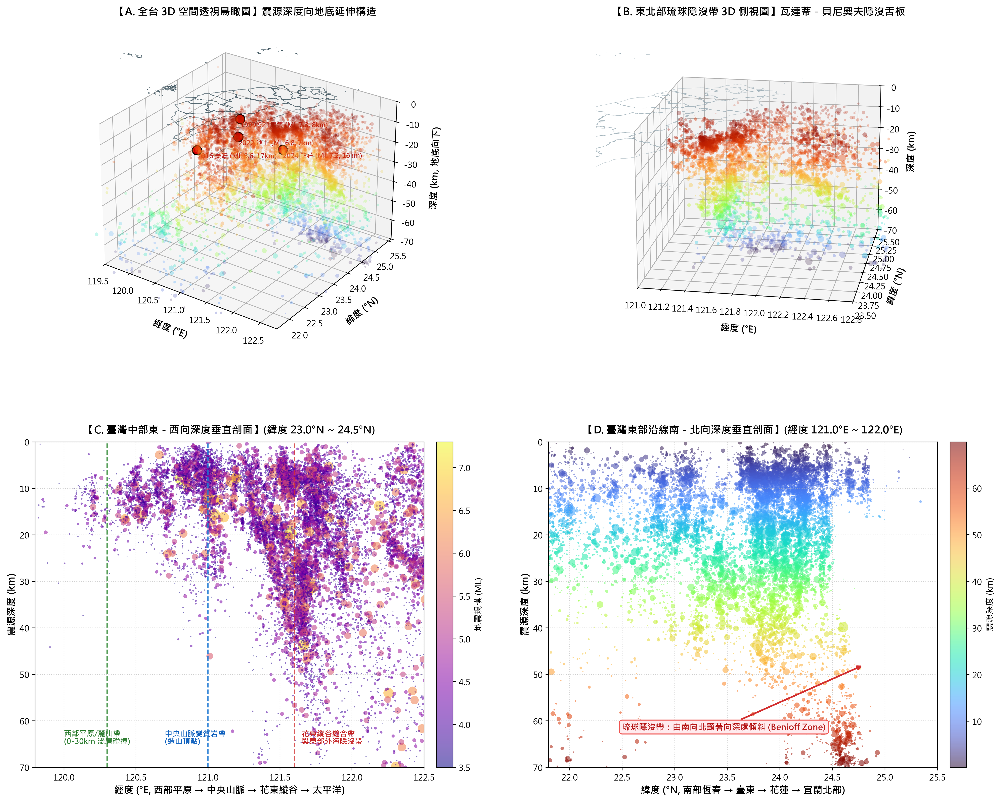
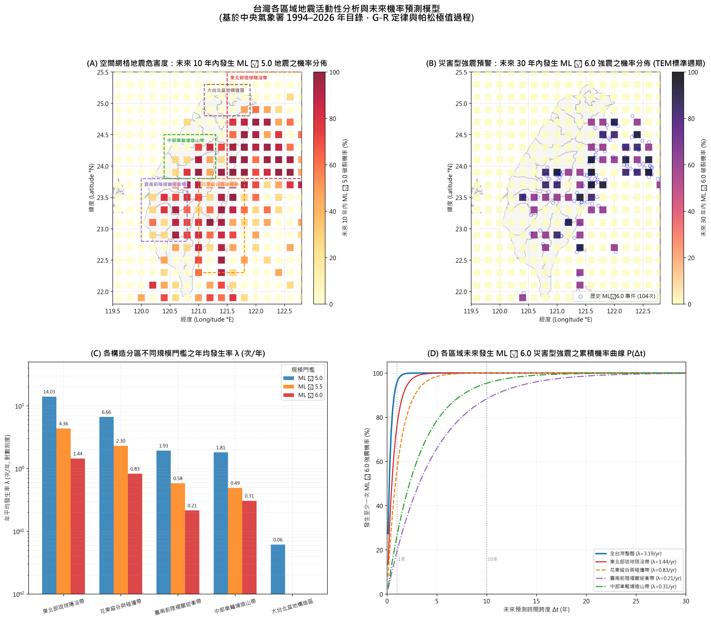

# 臺灣地震活動度觀測、3D 地下空間構造建模與各縣市未來機率預測模型專題
(Taiwan Seismicity Observation, 3D Hypocenter Modeling & County-Level Probabilistic Hazard Forecasting)

基於交通部中央氣象署（CWA）GDMS 原生地震目錄（1994–2026 年，涵蓋 32.58 年、共計 873,145 筆完整儀器地震紀錄）與臺灣縣市圖資（`TW_country_pop_TM2.gpkg`，經 TM2 轉 WGS84 經緯度座標），本專案完成：
1. **各縣市在地化感震生活圈危害度分析**（20km 緩衝圈空間聯結、19 縣市未來破裂機率與回歸期排行）。
2. **三維地下空間震源構造建模**（3D Hypocenter & Wadati-Benioff Zone Modeling，含多角度剖面與 WebGL 互動網頁）。
3. **區域與空間網格未來機率預測模型**（Stationary Poisson Process，計算 1 個月至 30 年各分區 $M_L \ge 5.0 \sim 7.0$ 之累積破裂機率）。
4. **空間震度疊圖與分區回歸週期**（古騰堡－芮克特 G-R 線性定律與 Benioff 累積應變釋放模型）。

---

## 專案內容與目錄結構

```text
├── 腳本/
│   ├── 建立全台各縣市地震機率與危害預測模型.py   # 空間聯結 19 縣市生活圈，計算各縣市發生率、回歸週期、排行與出圖
│   ├── 建立3D地震空間構造模型.py               # 抽取全量強震與分層抽樣，產生四視角立體剖面圖與 WebGL 互動網頁
│   ├── 建立未來地震機率預測模型.py             # 演算五大構造分區與 0.2° 空間網格帕松破裂機率矩陣
│   ├── 繪製縣市疊圖與分區預估.py               # 疊合 GPKG 縣市界與微震熱密度，產生五大分區預估資訊卡
│   ├── 繪製分區預估深入比較圖.py               # 五大分區 G-R 擬合線、重現期曲線、嘉南與東北應變階梯圖
│   └── 繪製台灣地震預估分析圖.py               # 全台四分格模型解析圖（G-R定律、全台應變累積、空間分佈、重現期曲線）
├── 數據/
│   ├── 台灣各縣市未來地震機率與危害度分析表.csv # 全台各縣市完整指標（含回歸期、極淺層比例、1年/5年/10年/30年機率）
│   └── 台灣各區域地震危害度與未來機率預測表.csv # 五大構造區與全台數值表格
├── 台灣各縣市未來地震機率與危害預測圖.png      # 4 子圖：各縣市10年M5機率地圖、30年M6機率地圖、縣市排行榜、時間曲線
├── 台灣3D地震空間構造建模與剖面解析.png          # 3D 立體鳥瞰、東北側視、東西與南北垂直剖面解析圖
├── 台灣3D地震空間構造建模.html                  # 獨立 WebGL 3D 互動網頁，支援 360 度旋轉縮放與震源資訊懸浮檢視
├── 台灣各分區未來地震機率與規模預測模型.png      # 4 子圖：10年 M5/30年 M6 空間網格危害圖、年均發生率、時間破裂機率曲線
├── 台灣縣市地震活動度疊圖與分區空間預估圖.png      # 高解析度縣市疊圖與五大分區預估卡片
├── 台灣五大區域地震規模頻率與重現週期預估比較.png  # 五大分區 G-R 線性擬合、重現週期、累積應變深度對比
├── 台灣地震活動度與線性預估模型解析.png          # 全台層級地震預估模型綜合解析圖
├── 台灣各縣市未來地震機率與在地風險深度解析報告.md # 各縣市在地化詳細數據、災害研判與防震報告
├── 台灣未來地震機率與規模預測模型深度報告.md    # 3D 構造與各分區未來機率/規模預測深度科學解析報告
├── 台灣各分區地震活動度與線性預估模型深度解析報告.md # 涵蓋縣市、G-R參數、重現期、板塊能量赤字深度報告
└── 台灣地震活動度與線性預估模型科學解析報告.md    # 基礎線性預估概念與物理意涵解析報告
```

---

## 全臺各縣市感震生活圈危害度排行榜

| 排名 | 縣市名稱 | 32年 M≥5.0 | 32年 M≥6.0 | 平均深度 | 極淺層佔比 (<15km) | M5平均回歸期 | 未來 1 年 M5 機率 | 未來 10 年 M5 機率 | 未來 10 年 M6 機率 | 未來 30 年 M6 機率 |
| :---: | :--- | :---: | :---: | :---: | :---: | :---: | :---: | :---: | :---: | :---: |
| **1** | **花蓮縣** | 412 次 | 40 次 | 16.8 km | 46.0% | **約 29 天** | **100.0%** | **100.0%** | **100.0%** | **100.0%** |
| **2** | **宜蘭縣** | 133 次 | 12 次 | 16.6 km | 45.7% | **約 2.9 月** | **98.3%** | **100.0%** | **97.5%** | **100.0%** |
| **3** | **臺東縣** | 162 次 | 20 次 | 17.1 km | 44.7% | **約 2.4 月** | **99.3%** | **100.0%** | **99.8%** | **100.0%** |
| **4** | **南投縣** | 125 次 | 19 次 | 10.5 km | **70.9%** | **約 3.1 月** | **97.8%** | **100.0%** | **99.7%** | **100.0%** |
| **5** | **高雄市** | 66 次 | 6 次 | 9.9 km | **74.9%** | **約 5.9 月** | **86.8%** | **100.0%** | **84.2%** | **99.6%** |
| **6** | **嘉義縣** | 61 次 | 7 次 | 10.5 km | **83.4%** | **約 6.4 月** | **84.6%** | **100.0%** | **88.3%** | **99.8%** |
| **7** | **臺南市** | 45 次 | 5 次 | 12.5 km | **71.5%** | **約 8.7 月** | **74.9%** | **100.0%** | **78.5%** | **99.0%** |
| **8** | **臺中市** | 38 次 | 2 次 | 9.1 km | **77.5%** | **約 10.3 月**| **68.9%** | **100.0%** | **45.9%** | **84.2%** |
| **9** | **屏東縣** | 39 次 | 4 次 | 15.0 km | 50.1% | **約 10.0 月**| **69.8%** | **100.0%** | **70.7%** | **97.5%** |
| **10** | **雲林縣** | 30 次 | 6 次 | 10.0 km | **79.0%** | **約 1.1 年** | **60.2%** | **100.0%** | **84.2%** | **99.6%** |
| **11** | **苗栗縣** | 18 次 | 0 次 | 6.7 km | **85.5%** | **約 1.8 年** | **42.5%** | **99.6%** | **0.0%** | **0.0%** |
| **12** | **嘉義市** | 16 次 | 3 次 | 11.0 km | **84.6%** | **約 2.0 年** | **38.8%** | **99.3%** | **60.2%** | **93.7%** |
| **13** | **彰化縣** | 15 次 | 4 次 | 11.0 km | **70.9%** | **約 2.2 年** | **36.9%** | **99.0%** | **70.7%** | **97.5%** |
| **14** | **新北市** | 13 次 | 1 次 | 11.3 km | 63.3% | **約 2.5 年** | **32.9%** | **98.2%** | **26.4%** | **60.2%** |
| **15** | **新竹縣** | 7 次 | 0 次 | 6.3 km | **79.5%** | **約 4.7 年** | **19.3%** | **88.3%** | **0.0%** | **0.0%** |
| **16** | **桃園市** | 6 次 | 0 次 | 45.1 km | 27.1% | **約 5.4 年** | **16.8%** | **84.2%** | **0.0%** | **0.0%** |
| **17** | **基隆市** | 1 次 | 0 次 | 12.9 km | 60.0% | **約 32.6 年**| **3.0%** | **26.4%** | **0.0%** | **0.0%** |
| **18** | **臺北市** | 1 次 | 0 次 | 37.3 km | 50.0% | **約 32.6 年**| **3.0%** | **26.4%** | **0.0%** | **0.0%** |
| **19** | **新竹市** | 1 次 | 0 次 | 9.5 km | 75.0% | **約 32.6 年**| **3.0%** | **26.4%** | **0.0%** | **0.0%** |

---

## 核心圖表展示

1. **各縣市在地化未來地震機率與規模危害預測圖**
   

2. **三維地下地震空間構造建模與多角度垂直剖面**
   

3. **各區域未來地震機率與規模預測模型（空間網格與破裂機率曲線）**
   

4. **臺灣縣市圖資疊圖與五大構造分區地震預估卡片**
   

---

## 引用與致謝

- **地震觀測數據來源**：交通部中央氣象署地球物理資料管理系統（GDMS）
- **空間地理圖資來源**：內政部國土測繪中心 / 台灣縣市人口與行政疆界 GPKG
- **分析與建模技術棧**：Python (Geopandas, Matplotlib, Pandas, NumPy, SciPy, Shapely, Plotly WebGL)
