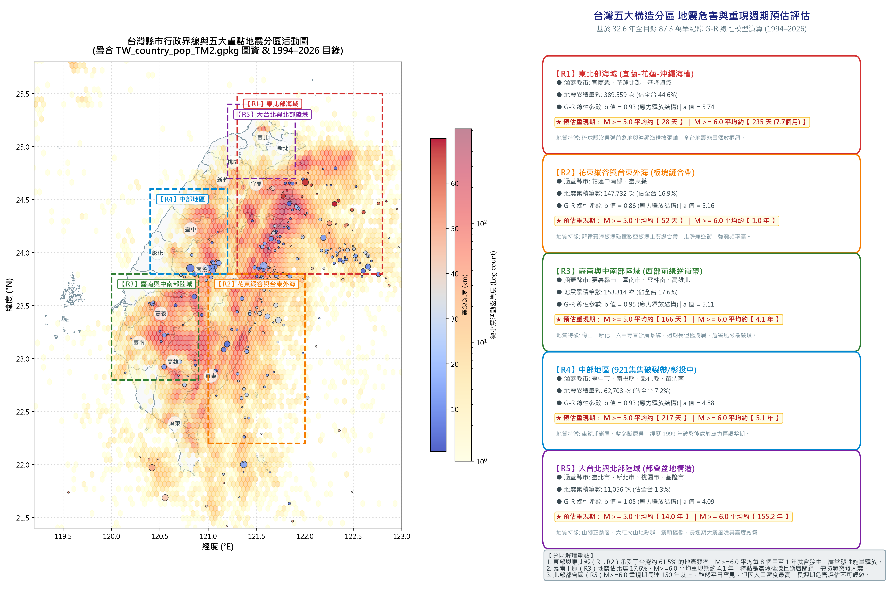
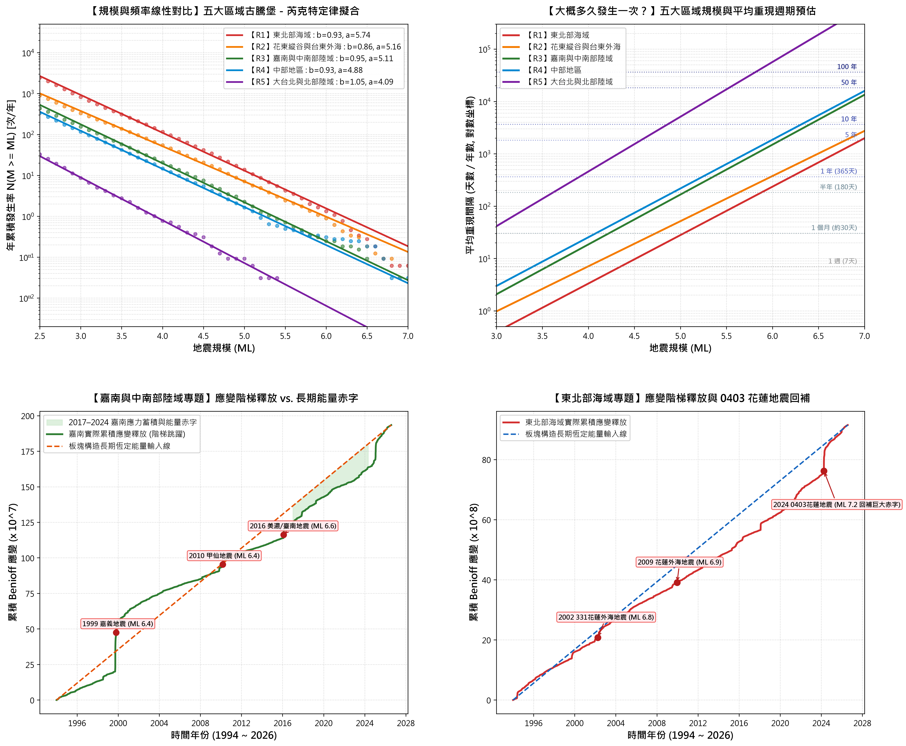
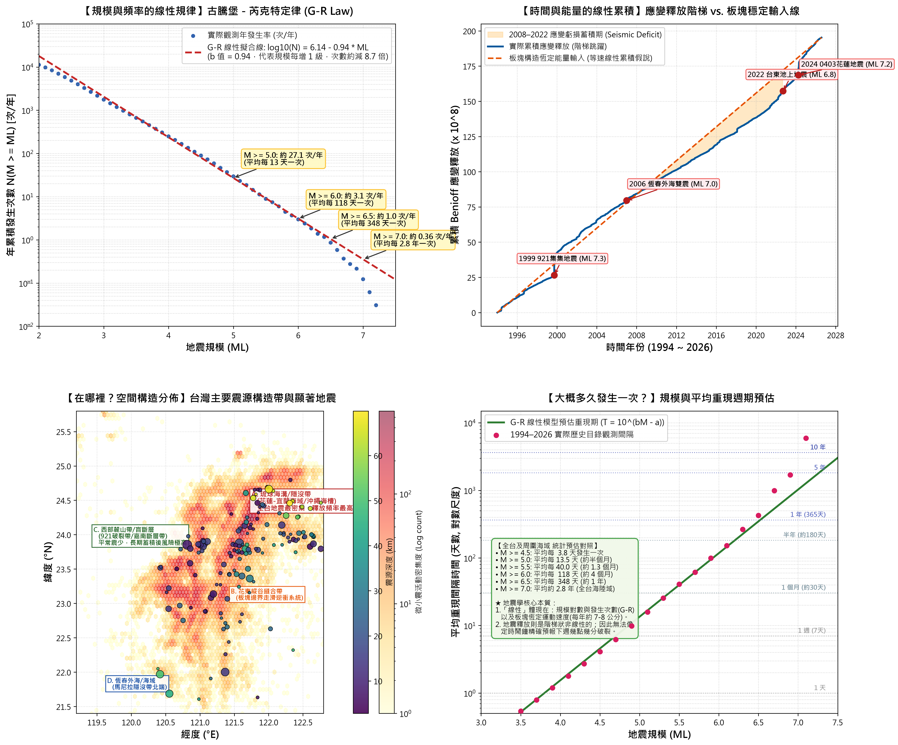

# 臺灣地震活動度觀測與區域線性預估模型專題 (Taiwan Seismicity & Regional Hazard Prediction)

基於中央氣象署 GDMS 原生地震目錄（1994–2026 年，共 873,145 筆事件）與臺灣縣市圖資（`TW_country_pop_TM2.gpkg`），結合統計地震學古騰堡－芮克特定律（Gutenberg-Richter Law）與板塊累積 Benioff 應變釋放模型，針對臺灣全區及五大核心構造分區進行空間活動度疊圖、重現週期演算與能量赤字評估。

---

## 專案內容架構

```text
├── 腳本/
│   ├── 繪製縣市疊圖與分區預估.py               # 疊合 GPKG 縣市界與微震熱密度，產生五大分區預估資訊卡
│   ├── 繪製分區預估深入比較圖.py               # 五大分區 G-R 擬合線、重現期曲線、嘉南與東北應變階梯圖
│   └── 繪製台灣地震預估分析圖.py               # 全台四分格模型解析圖（G-R定律、全台應變累積、空間分佈、重現期曲線）
├── 台灣縣市地震活動度疊圖與分區空間預估圖.png      # 高解析度縣市疊圖與五大分區預估卡片
├── 台灣五大區域地震規模頻率與重現週期預估比較.png  # 五大分區 G-R 線性擬合、重現週期、累積應變深度對比
├── 台灣地震活動度與線性預估模型解析.png          # 全台層級地震預估模型綜合解析圖
├── 台灣各分區地震活動度與線性預估模型深度解析報告.md # 涵蓋縣市、G-R參數、重現期、板塊能量赤字深度報告
└── 台灣地震活動度與線性預估模型科學解析報告.md    # 基礎線性預估概念與物理意涵解析報告
```

---

## 五大分區關鍵預估結論

| 分區 | 涵蓋縣市 | 32年累積筆數 | G-R $b$ 值 | $M_L \ge 5.0$ 預估平均間隔 | $M_L \ge 6.0$ 預估平均間隔 | 構造特徵與危害評估 |
| :--- | :--- | :---: | :---: | :---: | :---: | :--- |
| **【R1】東北部海域** | 宜蘭縣、花蓮北部、基隆外海 | 389,559 筆 (44.6%) | 0.93 | **約 28 天** | **約 7.7 個月** | 琉球隱沒帶與沖繩海槽張裂軸，全台地震最頻繁的常態釋放樞紐。 |
| **【R2】花東縱谷與外海** | 花蓮中南部、臺東縣 | 147,732 筆 (16.9%) | **0.86** | **約 52 天** | **約 1.0 年** | 兩大板塊正向碰撞帶，走滑兼逆衝，$b$ 值全台最低（大震比例最高）。 |
| **【R3】嘉南與中南部陸域** | 嘉義縣市、臺南市、雲林南、高雄北 | 153,314 筆 (17.6%) | 0.95 | **約 166 天** (約5.5月) | **約 4.1 年** | 梅山、新化、六甲等盲斷層系統。平時微震散布，活動週期長但多極淺層，危害度最高。 |
| **【R4】中部地區** | 臺中市、南投縣、彰化縣、苗栗南 | 62,703 筆 (7.2%) | 0.93 | **約 217 天** (約7.1月) | **約 5.1 年** | 車籠埔斷層帶，經歷 1999 年破裂後，目前處於震後長期應力調整期。 |
| **【R5】大台北與北部陸域** | 臺北市、新北市、桃園市、基隆市 | 11,056 筆 (1.3%) | **1.05** | **約 14.0 年** | **約 155 年** | 山腳正斷層、大屯火山群。平時震頻極低，但人口最稠密，長週期風險不可忽視。 |

---

## 核心圖表展示

1. **縣市疊圖與五大分區空間活動預估**
   

2. **五大區域規模頻率與重現週期預估比較**
   

3. **全台地震活動度與線性預估模型綜合解析**
   

---

## 引用與致謝

- **地震數據來源**：交通部中央氣象署地球物理資料管理系統（GDMS）
- **圖資來源**：內政部國土測繪中心 / 台灣縣市人口與行政疆界 GPKG
- **分析與建模工具**：Python (Geopandas, Matplotlib, Pandas, NumPy, SciPy)
