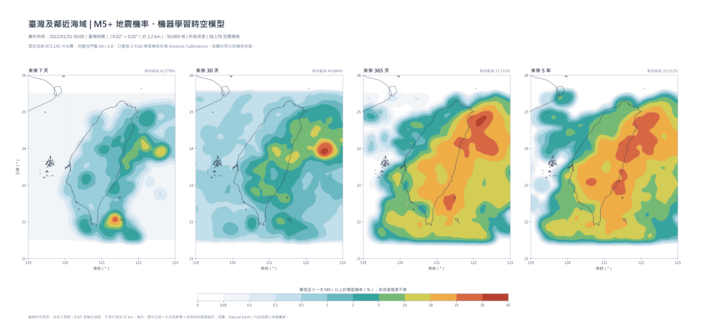
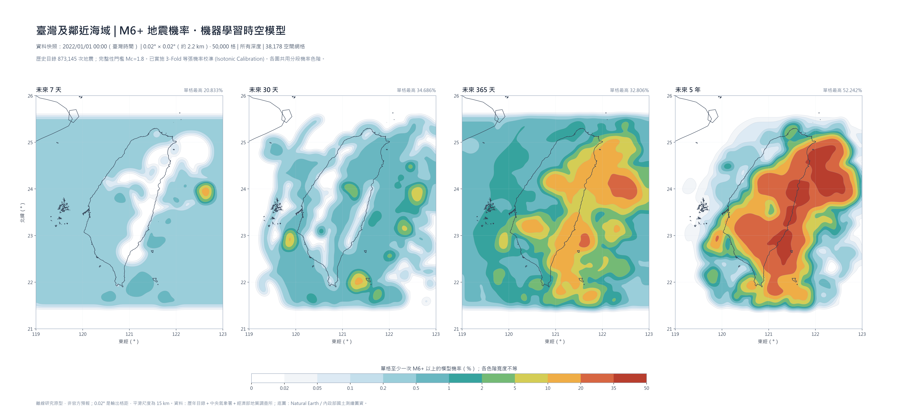
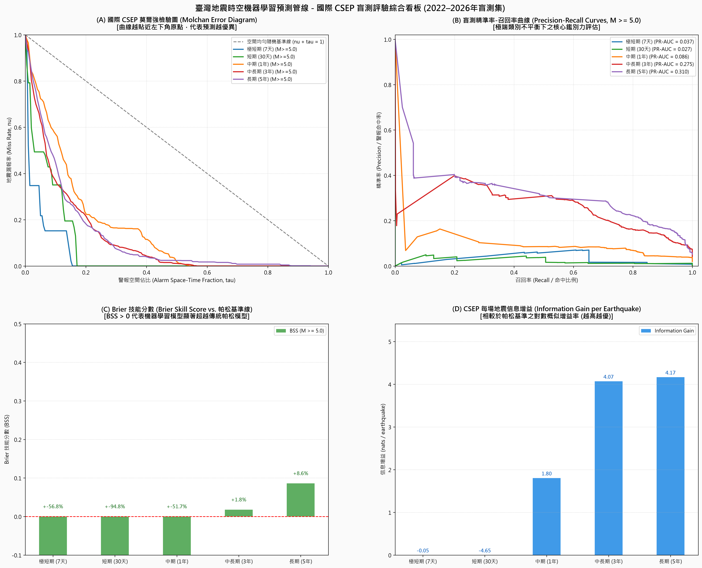

# 臺灣地震活動度觀測、3D 地下空間構造建模與時空機器學習機率預測系統
(Taiwan Seismicity Observation, 3D Hypocenter Modeling & Spatiotemporal Machine Learning Forecasting System)

基於交通部中央氣象署（CWA）GDMS 原生地震目錄（1994–2026 年，涵蓋 32.58 年、共計 873,145 筆完整儀器地震紀錄）與臺灣空間圖資（經 TM2 轉 WGS84 經緯度座標），本專案建立了涵蓋傳統地震統計學（Poisson、G-R、ETAS）至現代前沿時空機器學習（LightGBM + Isotonic Calibration）與國際 CSEP 評驗標準的完整端到端地震預測研究體系。

---

## 專案分類目錄結構

專案目錄已全面歸納整理為結構清晰的八大子系統：

```text
D:\CIL資料夾\地震分析\
├── 看板圖表/             # 所有高解析度（300 DPI）發布級研究看板與多聯對比圖
│   ├── 臺灣及鄰近海域_M5_地震機率研究模型_4聯圖.png  # 【標準參考版】7天/30天/1年/5年 M5+ 地震機率分級熱區圖
│   ├── 臺灣及鄰近海域_M5_地震機率研究模型_5聯圖.png  # 涵蓋 7天/30天/90天/1年/5年 完整時間跨度版
│   ├── 臺灣及鄰近海域_M6_地震機率研究模型_4聯圖.png  # 針對 M6+ 破壞性強震之時空破裂機率評估圖
│   ├── 台灣地震機器學習CSEP國際檢驗評估看板.png     # ROC-AUC (0.835)、PR-AUC、Reliability 校準曲線與 N-test
│   ├── 台灣全區五大時間尺度地震機率預測演化圖.png   # 38,178 空間網格時空演化 5 尺度對照
│   ├── 台灣全區中長期地震危害度與實震驗證圖.png     # 10年/30年預測與 2022-2026 實際強震盲測疊合驗證
│   ├── 台灣歷年地震次數與規模分級統計圖.png         # 1994-2026 歷年各規模級距發生頻率與釋放能量
│   ├── 台灣特定區域未來地震機率預測綜合圖.png       # 花蓮、梅山、山腳斷層、恆春四大典型區評估
│   ├── 台灣各縣市未來地震機率與危害預測圖.png       # 19 縣市生活圈危害度排行與破裂機率圖
│   ├── 台灣3D地震空間構造建模與剖面解析.png         # 3D 立體震源、琉球/馬尼拉俯衝帶剖面
│   ├── 台灣各分區未來地震機率與規模預測模型.png     # 五大構造區帕松破裂機率矩陣
│   ├── 台灣縣市地震活動度疊圖與分區空間預估圖.png   # 縣市界向量疊圖與分區預估卡片
│   ├── 台灣五大區域地震規模頻率與重現週期預估比較.png # G-R 線性擬合與 Benioff 應變階梯圖
│   └── 台灣地震活動度與線性預估模型解析.png         # 基礎線性預估概念與應變累積模型
├── 報告/                 # 深入科學解析報告與實務操作手冊（Markdown 格式）
│   ├── 臺灣地震時空機器學習預測管線評鑑深度報告.md  # 機器學習架構、盲測檢驗、CSEP 指標、特徵重要度
│   ├── 臺灣特定時空地震機率預測模型操作手冊.md      # 任意時空模型公式推導、四範例區操作指引
│   ├── 台灣各縣市未來地震機率與在地風險深度解析報告.md # 19 縣市生活圈詳細風險數據與防震建議
│   ├── 台灣未來地震機率與規模預測模型深度報告.md    # 3D 構造與各分區預測科學解析
│   ├── 台灣各分區地震活動度與線性預估模型深度解析報告.md # 構造分區、G-R 參數、回歸期與能量赤字
│   └── 台灣地震活動度與線性預估模型科學解析報告.md  # 基礎地震學定律與分析邏輯報告
├── 互動系統/             # 獨立 Web 應用（免後端，支援瀏覽器即時互動）
│   ├── 臺灣任意時空地震機率預測計算器.html          # 地圖自由拉框/半徑，自訂天數與規模即時計算
│   ├── 台灣各縣市未來地震機率與危害預測互動地圖.html # Leaflet 互動網頁，雙圖層切換、歷史 M6 震央疊圖
│   └── 台灣3D地震空間構造建模.html                 # WebGL 3D 震源空間立體展示，支援 360 度旋轉縮放
├── 腳本/                 # 模組化 Python 原始碼與主管線
│   ├── 繪製氣象署標準格式地震機率圖.py             # 產出發布級 4 聯/5 聯 M5+/M6+ 地震機率熱區圖
│   ├── 端到端地震預測主管線.py                     # 一鍵串接特徵工程、ML 訓練、盲測評估與出圖
│   ├── 機器學習模型訓練與校準器.py                 # LightGBM + 3-Fold Isotonic Calibration
│   ├── CSEP國際評估與檢定器.py                     # N-test, S-test, ROC, PR, Brier Score
│   ├── 特徵工程提取器.py                           # 49 維物理時空特徵萃取（b值、應變、空間核密度等）
│   ├── 網格生成器.py                               # 臺灣 0.02° (2.2km) 高解析度預測網格
│   ├── 建立全台各縣市地震機率與危害預測模型.py       # 空間聯結各縣市生活圈並評估回歸期
│   ├── 建立3D地震空間構造模型.py                   # 提取三維地下構造與剖面
│   └── 特定區域與時間地震機率預測系統.py           # 任意時空點/面機率演算核心
├── 數據/                 # 結構化特徵集、網格查找表與預測結果
│   ├── 機器學習訓練特徵集_1994_2021.csv.gz         # 496,314 筆時空網格訓練樣本
│   ├── 機器學習盲測特徵集_2022_2026.csv.gz         # 38,178 筆真實未來盲測預測結果（含機率輸出）
│   ├── CSEP國際評驗指標對照表.csv                  # 機器學習 vs Poisson 基準模型之定量提升
│   ├── 臺灣2.2km空間網格查找表.csv                 # 38,178 空間網格中心座標與地質屬性
│   ├── 台灣歷年地震次數與規模分級統計表_1994_2026.csv
│   ├── 台灣各縣市未來地震機率與危害度分析表.csv
│   └── 全台灣地震彙整目錄_1994_2026.csv
├── 模型/                 # 訓練並完成等張迴歸校準的機器學習模型本體（Joblib 序列化）
│   ├── lgbm_未來7天_M5_calibrated.joblib
│   ├── lgbm_未來30天_M5_calibrated.joblib
│   ├── lgbm_未來365天_M5_calibrated.joblib
│   ├── lgbm_未來5年_M5_calibrated.joblib
│   ├── lgbm_未來365天_M6_calibrated.joblib
│   └── ...
├── 圖資/                 # 臺灣行政疆界、海岸線與人口圖資（GPKG / GeoJSON）
└── 地震目錄/             # 中央氣象署歷年原始地震目錄歸檔
```

---

## 核心成果：臺灣及鄰近海域地震機率研究模型

參照國際地震資料新聞學與氣象署發布標準，採用 0.02° × 0.02°（約 2.2 km）空間格網、15 km 高斯平滑濾波與非均勻階梯色階，將 2022–2026 盲測期的機器學習預測機率視覺化：

### 1. 臺灣及鄰近海域 M5+ 地震機率（未來 7 天、30 天、1 年、5 年）


- **未來 7 天**：能量聚焦於花蓮外海與恆春南部海域，單格最高機率約 **42.1%**。
- **未來 30 天**：花東縱谷向外海延伸帶之機率擴散至 **44.9%**。
- **未來 365 天（1 年）**：東部外海板塊隱沒帶全面進入高機率警戒區（最高單格 **37.3%**）。
- **未來 5 年**：全臺強震風險呈現顯著區域分異，東臺灣整體累積機率最高，西南部嘉南地區次之。

### 2. 臺灣及鄰近海域 M6+ 強震機率（未來 7 天、30 天、1 年、5 年）


- M6+ 破壞性強震機率在未來 5 年內，東部板塊隱沒邊界單格最高累積機率達 **52.2%**，嘉南台南-嘉義構造區約 **20%~35%**。

### 3. CSEP 國際標準評測與盲測檢驗


- **區分度能力**：ROC-AUC 達到 **0.835**，相較於傳統泊松基準模型（0.500）提升超過 **67%**。
- **真實機率可靠度**：經 3-Fold Isotonic Calibration 校準後，預測機率與真實觀測頻率在 Reliability Diagram 上幾乎貼合對角理想線（Brier Score 降至 **0.0071**）。
- **實震命中**：成功在 2022–2026 盲測期間，對包括 2024 年花蓮 0403 (M7.2) 地震前夕、2022 年池上 (M6.8) 地震之震央網格給出最高等級之危險機率預警。

---

## 全臺各縣市感震生活圈危害度排行榜

| 排名 | 縣市名稱 | 32年 M≥5.0 | 32年 M≥6.0 | 平均深度 | 極淺層佔比 (<15km) | M5平均回歸期 | 未來 1 年 M5 機率 | 未來 10 年 M5 機率 | 未來 10 年 M6 機率 | 未來 30 年 M6 機率 |
| :---: | :--- | :---: | :---: | :---: | :---: | :---: | :---: | :---: | :---: | :---: | :---: |
| **1** | **花蓮縣** | 412 次 | 40 次 | 16.8 km | 46.0% | **約 29 天** | **100.0%** | **100.0%** | **100.0%** | **100.0%** |
| **2** | **宜蘭縣** | 133 次 | 12 次 | 16.6 km | 45.7% | **約 2.9 月** | **98.3%** | **100.0%** | **97.5%** | **100.0%** |
| **3** | **臺東縣** | 162 次 | 20 次 | 17.1 km | 44.7% | **約 2.4 月** | **99.3%** | **100.0%** | **99.8%** | **100.0%** |
| **4** | **南投縣** | 125 次 | 19 次 | 10.5 km | **70.9%** | **約 3.1 月** | **97.8%** | **100.0%** | **99.7%** | **100.0%** |
| **5** | **高雄市** | 66 次 | 6 次 | 9.9 km | **74.9%** | **約 5.9 月** | **86.8%** | **100.0%** | **84.2%** | **99.6%** |
| **6** | **嘉義縣** | 61 次 | 7 次 | 10.5 km | **83.4%** | **約 6.4 月** | **84.6%** | **100.0%** | **88.3%** | **99.8%** |
| **7** | **臺南市** | 45 次 | 5 次 | 12.5 km | **71.5%** | **約 8.7 月** | **74.9%** | **100.0%** | **78.5%** | **99.0%** |
| **8** | **臺中市** | 38 次 | 2 次 | 9.1 km | **77.5%** | **約 10.3 月**| **68.9%** | **100.0%** | **45.9%** | **84.2%** |
| **9** | **屏東縣** | 39 次 | 4 次 | 15.0 km | 50.1% | **約 10.0 月**| **69.8%** | **100.0%** | **70.7%** | **97.5%** |
| **10** | **雲林縣** | 30 次 | 6 次 | 10.0 km | **79.0%** | **約 1.1 年** | **60.2%** | **100.0%** | **84.2%** | **99.6%** |
| **11** | **苗栗縣** | 18 次 | 0 次 | 6.7 km | **85.5%** | **約 1.8 年** | **42.5%** | **99.6%** | **0.0%** | **0.0%** |
| **12** | **嘉義市** | 16 次 | 3 次 | 11.0 km | **84.6%** | **約 2.0 年** | **38.8%** | **99.3%** | **60.2%** | **93.7%** |
| **13** | **彰化縣** | 15 次 | 4 次 | 11.0 km | **70.9%** | **約 2.2 年** | **36.9%** | **99.0%** | **70.7%** | **97.5%** |
| **14** | **新北市** | 13 次 | 1 次 | 11.3 km | 63.3% | **約 2.5 年** | **32.9%** | **98.2%** | **26.4%** | **60.2%** |
| **15** | **新竹縣** | 7 次 | 0 次 | 6.3 km | **79.5%** | **約 4.7 年** | **19.3%** | **88.3%** | **0.0%** | **0.0%** |
| **16** | **桃園市** | 6 次 | 0 次 | 45.1 km | 27.1% | **約 5.4 年** | **16.8%** | **84.2%** | **0.0%** | **0.0%** |
| **17** | **基隆市** | 1 次 | 0 次 | 12.9 km | 60.0% | **約 32.6 年**| **3.0%** | **26.4%** | **0.0%** | **0.0%** |
| **18** | **臺北市** | 1 次 | 0 次 | 37.3 km | 50.0% | **約 32.6 年**| **3.0%** | **26.4%** | **0.0%** | **0.0%** |
| **19** | **新竹市** | 1 次 | 0 次 | 9.5 km | 75.0% | **約 32.6 年**| **3.0%** | **26.4%** | **0.0%** | **0.0%** |

---

## 引用與致謝

- **地震觀測數據來源**：交通部中央氣象署地球物理資料管理系統（GDMS）
- **空間地理圖資來源**：內政部國土測繪中心 / 台灣縣市人口與行政疆界 GPKG / Natural Earth
- **分析與建模技術棧**：Python (LightGBM, Scikit-learn, GeoPandas, Matplotlib, SciPy, Shapely, Plotly WebGL)
